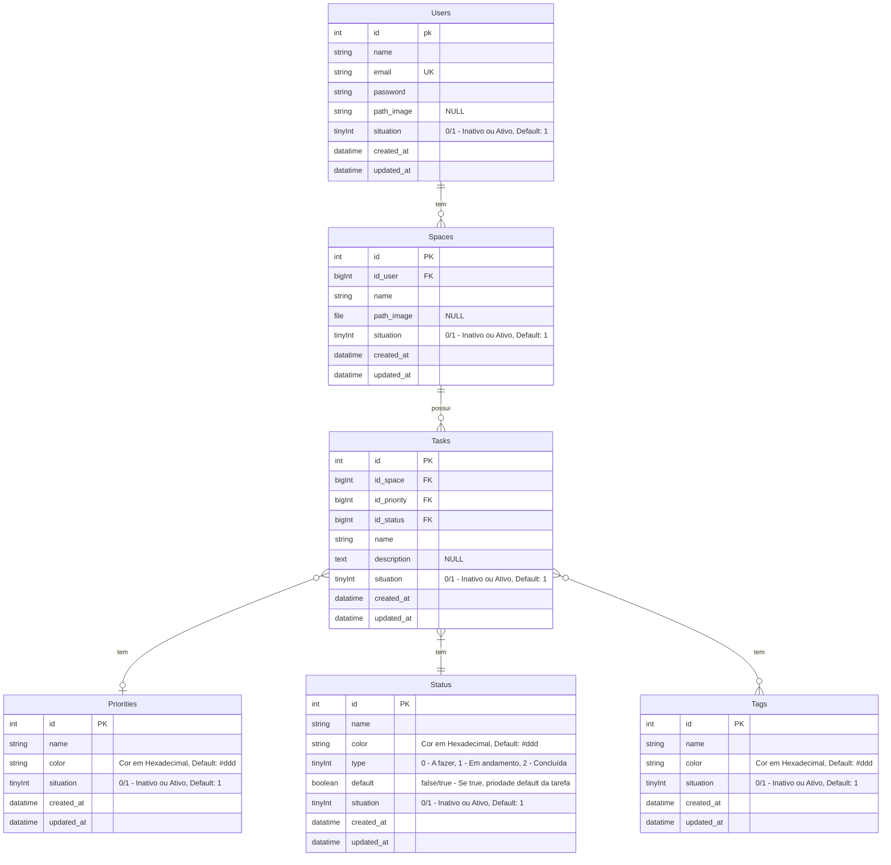

# App-Mobile
## Banco de Dados




## Configuração do Ambiente

1. Clone este repositório em sua máquina usando o seguinte comando:
```bash
git clone https://github.com/israelrodrigues01/app-mobile.git
```

2. Entre no repositório clonado
```bash
cd app-mobile/
```

3. Instale todas as dependências e modulos iniciais pelo terminal do projeto
```bash
npm install
```

4. O projeto está usando o Expo como forma de simular o sistema, para acessar via celular adicione no terminal
```bash
npm run dev
```
* Para isso é necessário instalar o [app da Expo (Expo Go)](https://docs.expo.dev/get-started/expo-go/) na sua loja de aplicativos

5. Caso queira visualizar via web
```bash
npm run web
```

6. Após rodar o comando anteriror pela primeira vez vai gerar um erro, não se preocupe, rode no terminal este comando e tente novamente o item anterior
```bash
npx expo install react-native-web@~0.19.6 react-dom@18.2.0 @expo/webpack-config@^19.0.0
```
* Para ter uma melhor experiência baixe a [extensão Mobile Simulator](https://chromewebstore.google.com/detail/mobile-simulator-responsi/ckejmhbmlajgoklhgbapkiccekfoccmk?pli=1) que simula celulares na web